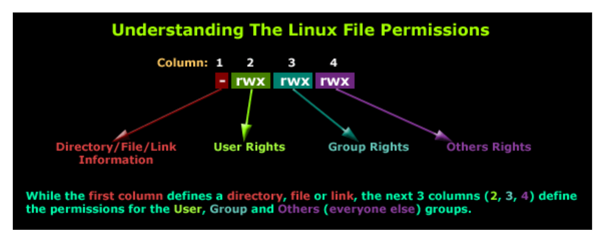
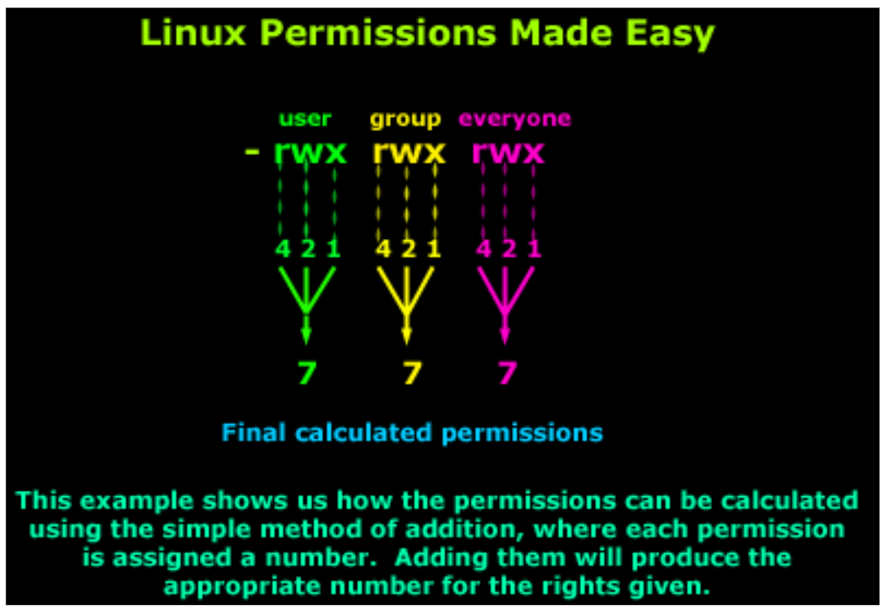

# Linux-File-Permissions-


## Task Objective  
This task focuses on understanding Linux file permissions. You are required to:
1. Learn how file permissions work in Linux.
2. Create a flowchart that visually explains permission categories and symbols.
3. Write a Python script that uses the `chmod` command to set a file's permissions to `rwxrwxr-x` (octal: `0775`).

---

## Understanding File Permissions in Linux

Linux file permissions control who can read, write, or execute a file. These permissions are represented using a combination of characters or octal numbers.

### a- Symbolic Meaning:
- `r` → **Read**: allows reading the file content  
- `w` → **Write**: allows modifying the file  
- `x` → **Execute**: allows executing the file as a program  
- `-` → No permission

### b- permission Segments:
Linux divides permissions into three categories:
- **User** (u): The file's owner
- **Group** (g): Users in the same group as the owner
- **Others** (o): All other system users

### c- Example:
```text
-rwxrwxr-x
```
This means:

User → read, write, execute ✅

Group → read, write, execute ✅

Others → read, execute (but no write) ❌

--- 

##  Python Script: Changing Permissions
Create a Python file named change_permission.py with the following content:

```python
import os

# Specify the file name
filename = "example.txt"

# Display permissions before change
before = oct(os.stat(filename).st_mode)[-3:]
print(f"Permissions before: {before}")

# Change file permissions to rwxrwxr-x (octal 0775)
os.chmod(filename, 0o775)

# Display permissions after change
after = oct(os.stat(filename).st_mode)[-3:]
print(f"Permissions after: {after}")

```
Note: Make sure example.txt exists in the same directory as your script.

---

## Flowchart: Linux Permissions Breakdown
```pgsql
[ Start ]
   ↓
[ Identify User Type ]
   ↓
[ Assign r, w, x based on role ]
   ↓
[ Combine to form final permission string ]
```




---
## Sample Output
When running the Python script in the terminal, the output should look like :
```bash
Permissions before: 644
Permissions after: 775

```
